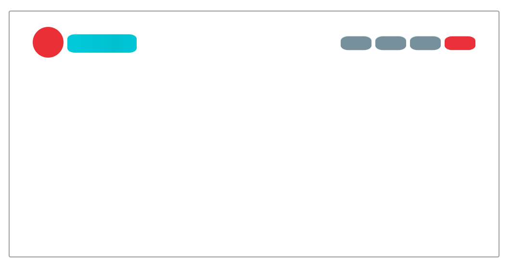
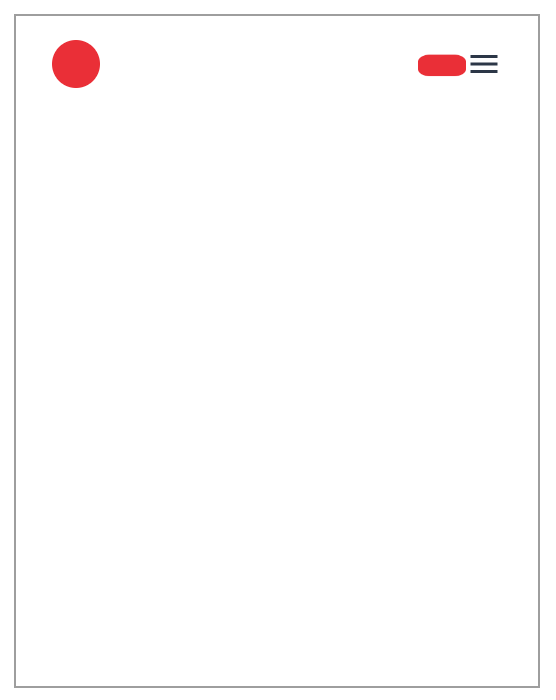
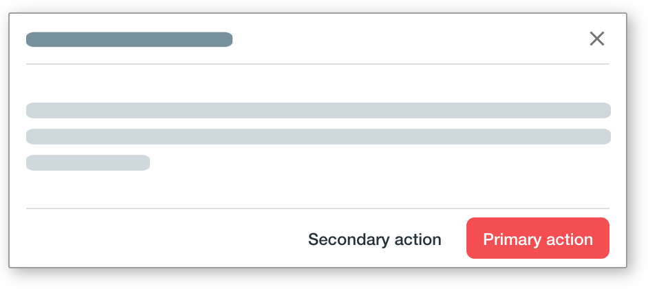

## Bear Essentails

Cut-n-paste ready Material-UI components for your SaaS.


### Responsive navbar

MUI doesn't comes with a responsive navbar out of the box.  Fortunately, you can easily build one yourself from `AppBar` and `Hidden`.

```
<BearAppBar
    brandingLogo={BrandingLogo}
    brandingText={BrandingText}
    desktopMenu={desktopMenu}
    mobileMenu={mobileMenu}
/>
```

#### Desktop



#### Mobile



---

### Dialog

```
    const [open, setOpen] = useState(false);

    return (
        <BearDialog
            title="A simple dialog"
            open={open}
            setOpen={setOpen}
        >
            <p>They can't scare me, if I scare them first ― Lady Gaga</p>
        </BearDialog>);

```

